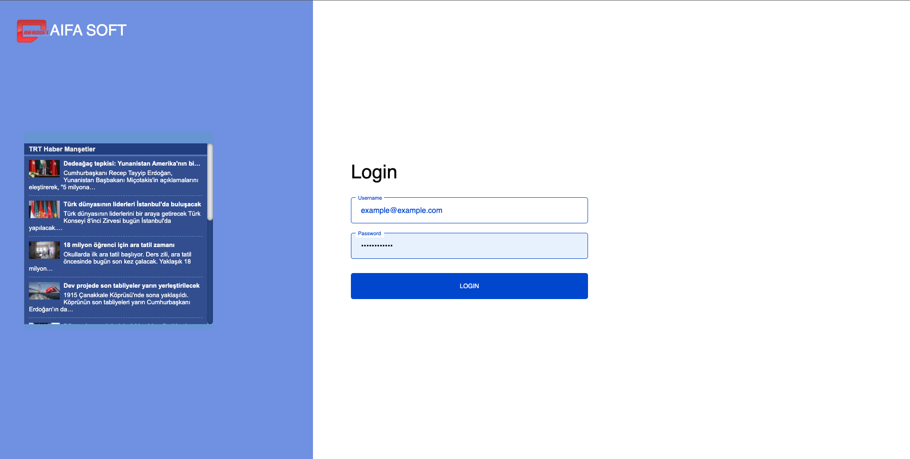
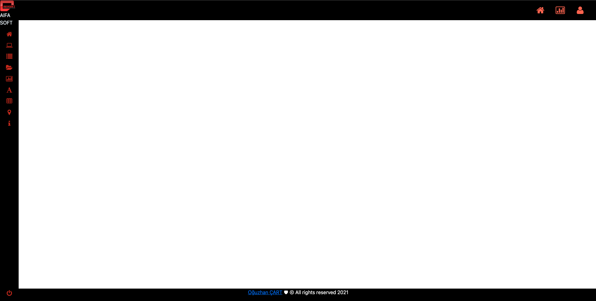
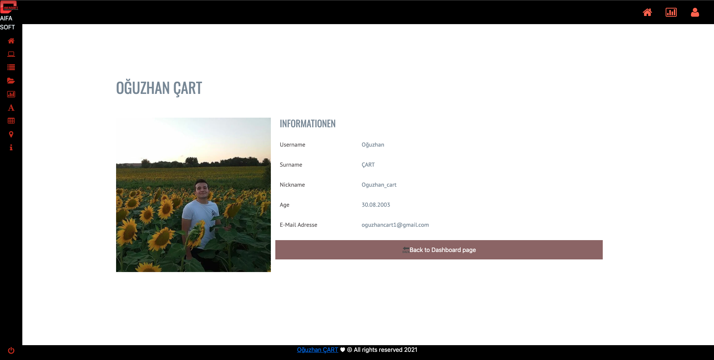
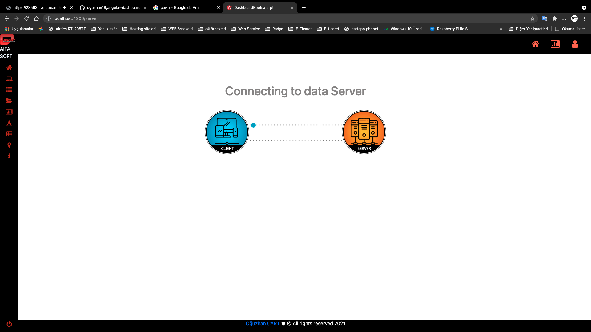
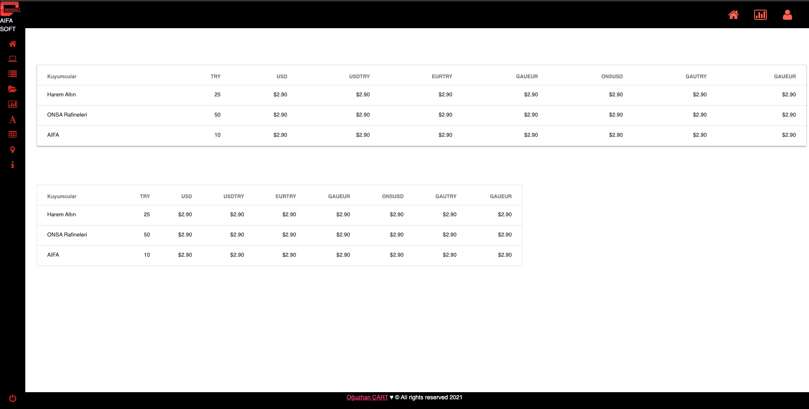

# Angular Dashboard Bootstrap
The simple dashboard I made with Angular can be developed and used component within component.
## Badges

Use it as you want

  
## Used technologies

**Client:** Angular, Bootstrap, Material, Chart.js, Form-Table, CSS, HTML, TS
##
**Server:** Angular.js
## Making
- Ease of Use.
- Angular - HTML page
- Use of Angular
- Use of BootStarp 
- Use of Material 
- Use of CSS

## Screenshots

## Web App in Web Site
http://oguzhancart.likesyou.org/

## For Support
For support, send an email to oguzhancart1@gmail.com or you are invited to our telegram channel https://t.me/vsform_tr  

## Codpen.io
[Codpen account link](https://codepen.io/oguzhan1881)
## Github Account Link
[Github account link](https://github.com/oguzhan18)
## Mail
oguzhancart1@gmail.com
# Instagram Account Link

##
# DashboardBootsatarpt

This project was generated with [Angular CLI](https://github.com/angular/angular-cli) version 11.2.1.

## Development server

Run `ng serve` for a dev server. Navigate to `http://localhost:4200/`. The app will automatically reload if you change any of the source files.

## Code scaffolding

Run `ng generate component component-name` to generate a new component. You can also use `ng generate directive|pipe|service|class|guard|interface|enum|module`.

## Build

Run `ng build` to build the project. The build artifacts will be stored in the `dist/` directory. Use the `--prod` flag for a production build.

## Running unit tests

Run `ng test` to execute the unit tests via [Karma](https://karma-runner.github.io).

## Running end-to-end tests

Run `ng e2e` to execute the end-to-end tests via [Protractor](http://www.protractortest.org/).

## Further help

To get more help on the Angular CLI use `ng help` or go check out the [Angular CLI Overview and Command Reference](https://angular.io/cli) page.
